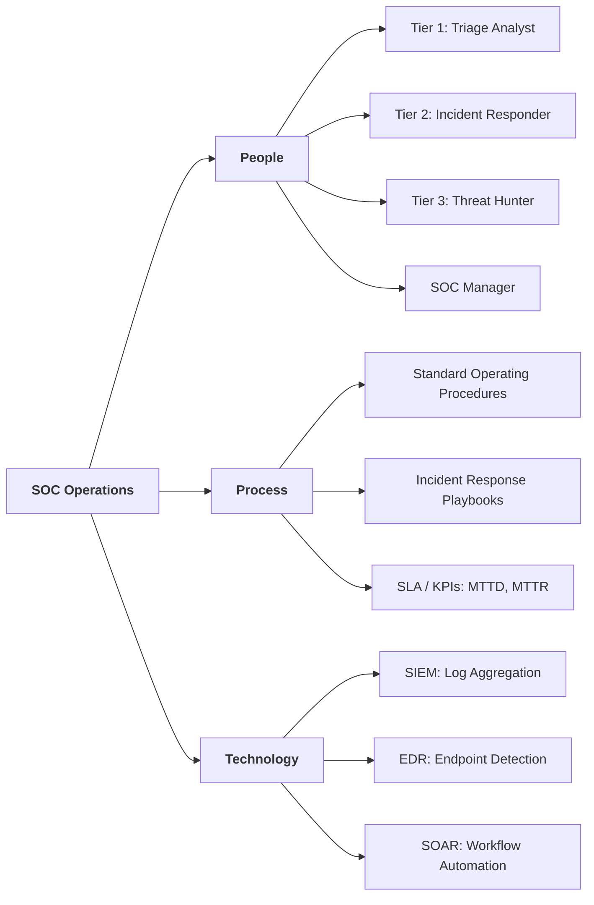

# Security Operations Center (SOC)

> **Overview:** A Security Operations Center (SOC) is a centralized operational unit that continuously monitors an organization's digital infrastructure to detect, analyze, and respond to cybersecurity threats in real time.

